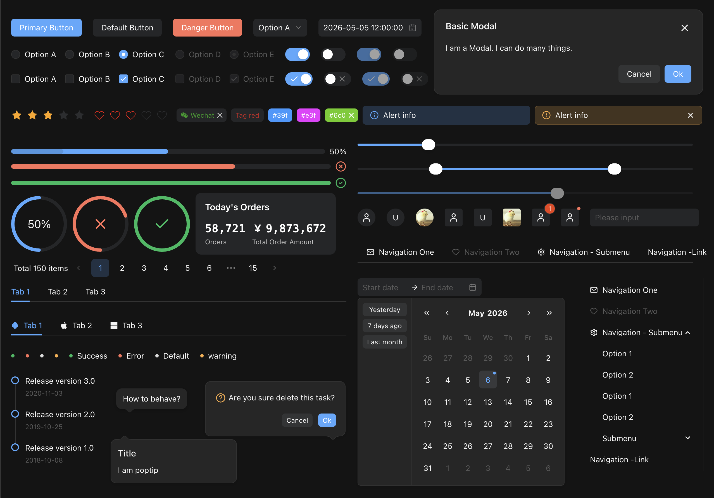

<p align="center">
  <a href="https://k-ui.cn">
    
  </a>
</p>
<h1 align="center">KUI Vue</h1>

<p align="center">
  <strong>A modern, TypeScript-first UI component library for Vue 3.</strong>
</p>

<p align="center">
  70+ polished components · Light &amp; dark themes · SSR &amp; Nuxt ready · Flexible design tokens
</p>

<p align="center">
  <a href="https://www.npmjs.com/package/kui-vue"></a>
  <a href="https://www.npmjs.com/package/kui-vue"></a>
  <a href="https://github.com/smallerqiu/kui-vue/actions/workflows/ci.yml"></a>
  <a href="https://github.com/smallerqiu/kui-vue"></a>
  <a href="./LICENSE"></a>
</p>

<p align="center">
  <a href="https://k-ui.cn"><strong>Documentation</strong></a> ·
  <a href="https://k-ui.cn/guide/quick-started">Quick Start</a> ·
  <a href="https://k-ui.cn/guide/components">Components</a> ·
  <a href="https://k-ui.cn/guide/dark-mode">Dark Mode</a> ·
  <a href="https://github.com/smallerqiu/kui-vue/issues">Issues</a>
</p>

<p align="center">
  English · <a href="README.zh-CN.md">简体中文</a>
</p>

<p align="center">
  <a href="https://k-ui.cn">
    
  </a>
</p>

<p align="center"><code>pnpm add kui-vue</code></p>

# Documentation

- [Quick Start](https://k-ui.cn/guide/quick-started)
- [Components Overview](https://k-ui.cn/guide/components)
- [Dark Mode](https://k-ui.cn/guide/dark-mode)
- [Icons](https://k-ui.cn/components/icons)
- [Internationalization](https://k-ui.cn/guide/language)
- [CHANGELOG](https://k-ui.cn/guide/change-log)

# Features

- Up to 70 high-quality Components.
- Internationalization Support for Dozens of Languages.
- Develop with TypeScript
- Supports Vue.js 3.x
- Supports SSR
- Supports [Nuxt.js](https://nuxtjs.org/)
- Supports Electron

# Install

```bash
npm install kui-vue --save
```

```bash
npm add kui-vue
```

```bash
yarn add kui-vue
```

```bash
bun add kui-vue
```

Using a script tag for global use:

```html
<!-- import stylesheet -->
<link rel="stylesheet" href="//unpkg.com/kui-vue/style/index.css" />
<!-- import kui -->
<script src="//unpkg.com/kui-vue"></script>
```

# Usage

```html
<template>
  <div>
    <k-button type="primary" @click="test">Primary</k-button>
  </div>
</template>
<script setup lang="ts">
  import { message } from "kui-vue";
  const test = () => {
    message.info("Hello kui !");
  };
</script>
```

## Local Development

```bash
git clone git@github.com:smallerqiu/kui-vue.git
cd kui-vue
pnpm install
pnpm dev
```

The documentation development server runs at [http://localhost:7005](http://localhost:7005) by default.

Common commands:

```bash
pnpm dev          # Start the documentation development server
pnpm typecheck    # Run TypeScript checks
pnpm build:docs   # Build the documentation site
pnpm build        # Build the component library and styles
```

## Browser Support

KUI Vue supports the latest two versions of major modern browsers, including Chrome, Edge, Firefox, and Safari. Internet Explorer is not supported.

## AI-assisted development

Kui Vue publishes version-matched component metadata, an Agent Skill, and an MCP server so coding assistants can use the public API without guessing.

```bash
pnpm exec kui-vue-ai init
pnpm exec kui-vue-mcp
```

- AI index: https://k-ui.cn/llms.txt
- Complete AI documentation: https://k-ui.cn/llms-full.txt
- Package metadata: `kui-vue/metadata`
- Metadata schema: `kui-vue/metadata/schema`
- Agent Skill: `kui-vue/skill`
- [Complete setup guide](./AI.en-US.md)

## Contributing

Issues and pull requests are welcome. Before submitting code, please ensure that the type checks and relevant builds pass.

- [GitHub repository](https://github.com/smallerqiu/kui-vue)
- [Gitee repository](https://gitee.com/chuchur/kui-vue)
- [Issue tracker](https://gitee.com/chuchur/kui-vue/issues)

## License

[MIT](./LICENSE)

Copyright © 2017-present Qiu
