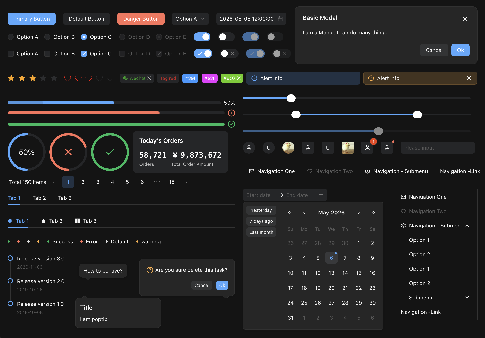

<p align="center">
    <a href="https://k-ui.cn">
        
    </a>
</p>
<h1 align="center">
   Kui for Vue
</h1>

<div align="center">

轻量级桌面UI组件库for Vue.js

[](https://www.npmjs.org/package/kui-vue)
[](https://npmjs.org/package/kui-vue)
[](https://npmjs.org/package/kui-vue)




[English](README.md) | 简体中文

</div>

# 文档

- [快速开始](https://k-ui.cn/guide/quick-started)
- [组件总览](https://k-ui.cn/guide/components)
- [暗色模式](https://k-ui.cn/guide/dark-mode)
- [Icons](https://k-ui.cn/components/icons)
- [国际化](https://k-ui.cn/guide/language)
- [更新日志](https://k-ui.cn/guide/change-log)

# 特性

- 50+高质量组件
- 国际化支持 14 种语言
- 使用TypeScript开发
- 支持Vue3.x
- 支持 SSR
- 支持 [Nuxt.js](https://nuxtjs.org/)
- 支持 Electron

# 安装

```bash
npm install kui-vue --save
```

```bash
npm add kui-vue
```

```bash
yarn add kui-vue
```

```bash
bun add kui-vue
```

使用脚本标记进行全局使用：

```html
<!-- import stylesheet -->
<link rel="stylesheet" href="//unpkg.com/kui-vue/style/index.css" />
<!-- import kui -->
<script src="//unpkg.com/kui-vue"></script>
```

# 使用

```html
<template>
  <div>
    <k-button type="primary" @click="test">Primary</k-button>
  </div>
</template>
<script setup lang="ts">
  import { message } from "kui-vue";
  const test = () => {
    message.info("Hello kui !");
  };
</script>
```

# 平台支持

Kui 支持所有主要的现代浏览器。

| [](https://cdnjs.cloudflare.com/ajax/libs/browser-logos/70.4.0/chrome/chrome.png)<br>chrome | [](https://cdnjs.cloudflare.com/ajax/libs/browser-logos/70.4.0/firefox/firefox.png)<br>firefox | [](https://cdnjs.cloudflare.com/ajax/libs/browser-logos/70.4.0/safari/safari.png)<br>safari | [](https://cdnjs.cloudflare.com/ajax/libs/browser-logos/70.4.0/edge/edge.png)<br> IE/Edge | [](https://cdnjs.cloudflare.com/ajax/libs/browser-logos/70.4.0/electron/electron.png)<br>Electron |
| ----------------------------------------------------------------------------------------------------------------------------------------------------------------------------------------------------------------- | ----------------------------------------------------------------------------------------------------------------------------------------------------------------------------------------------------------------------- | ----------------------------------------------------------------------------------------------------------------------------------------------------------------------------------------------------------------- | ------------------------------------------------------------------------------------------------------------------------------------------------------------------------------------------------------------ | ----------------------------------------------------------------------------------------------------------------------------------------------------------------------------------------------------------------------------- |
| latest 2 versions                                                                                                                                                                                                 | latest 2 versions                                                                                                                                                                                                       | latest 2 versions                                                                                                                                                                                                 | Edge                                                                                                                                                                                                         | latest 2 versions                                                                                                                                                                                                             |

# 本地开发

克隆仓库到本地:

```bash
$ git clone git@github.com:smallerqiu/kui-vue.git
$ cd kui-vue
$ npm install
$ npm start
```

打开浏览器访问 http://127.0.0.1:7005

# 生态

[Kui for react](https://react.k-ui.cn)

# 协议

[MIT](http://opensource.org/licenses/MIT)

Copyright (c) 2017-present, Chuchur
